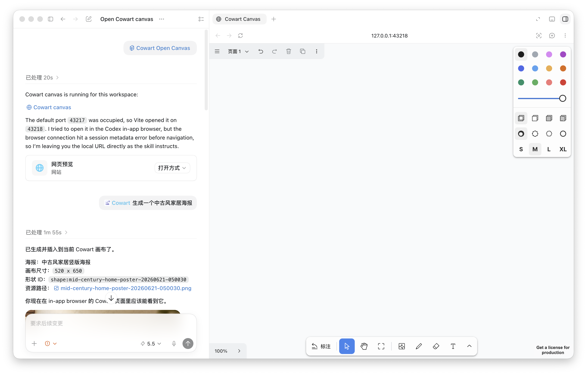
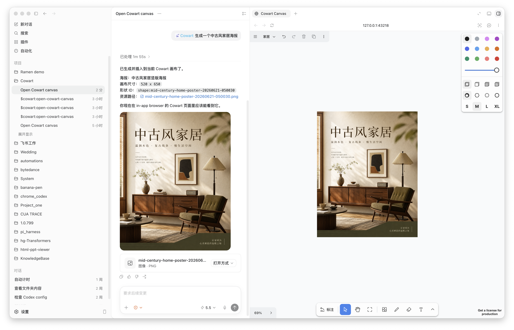
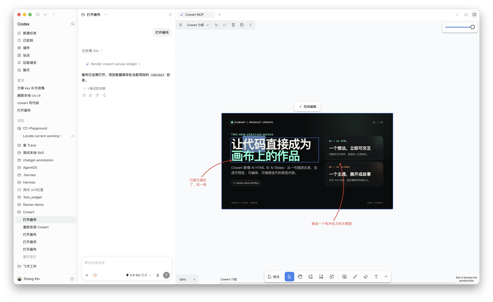
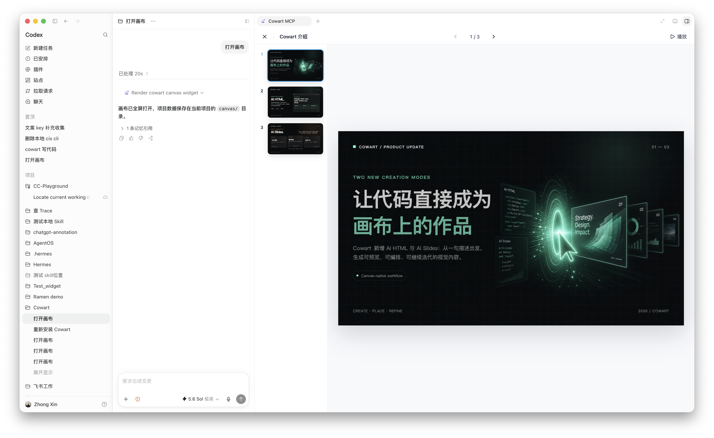
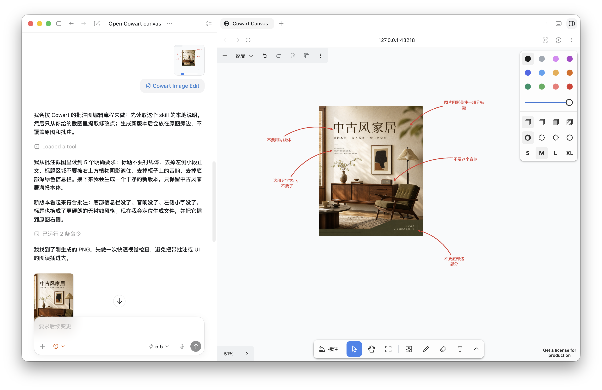

# Cowart

Cowart is a native infinite-canvas widget plugin for Codex. It brings a tldraw-powered canvas into Codex for visual thinking, annotation, image generation, and annotation-driven image edits. The canvas opens directly as an MCP widget, and its data is saved in the active user project under `canvas/` instead of inside the plugin repository.

The repository also conforms to [Agent Plugins v1.0.0](https://agent-plugins.org/specification): root-level `plugin.json`, `skills/`, and `mcp.json` provide the portable plugin entry points, while `.codex-plugin/plugin.json`, `.mcp.json`, and `.agents/plugins/marketplace.json` retain Codex-specific interface and installation metadata.

中文说明: [README.md](README.md)

## Features

- Open a native tldraw infinite-canvas widget from Codex; normal use no longer opens a local page through a web browser or the in-app browser.
- Persist canvas pages and image assets in the active project directory.
- Create AI image slots on the canvas, enter a prompt directly, choose reference images, and let Codex generate an image that replaces the selected slot at the same position and aspect ratio.
- Create a 16:9 `AI HTML` slot, generate a runnable single-file HTML page from a prompt and reference images, and embed it directly on the canvas for further editing and iteration.
- Create `AI Slides` to organize images and HTML into a deck, or ask Codex to generate a specified number of coordinated 16:9 HTML pages; preview the deck with thumbnails or play it fullscreen.
- After annotating an image, submit the annotation screenshot directly from the canvas so Codex can generate a clean revised image beside the original.
- Switch the image generation provider from the canvas main menu (`模型选择`): Codex default (OpenAI), Alibaba Qwen (DashScope), a custom OpenAI-compatible API, or a local ComfyUI server; every provider supports both text-to-image and reference-based image-to-image generation.
- Use Cowart MCP tools to read selection state, save the canvas, insert images or HTML, and save page-local assets.

## Installation

> [!IMPORTANT]
> After installation, completely quit and restart Codex once before using Cowart. Restarting ensures that Cowart's new skills and MCP tools are fully loaded.

### Ask Codex To Install It

Send the following message to Codex:

```text
Please install the Cowart API edition Codex plugin through the Git marketplace bundled with its repository.
First run codex plugin marketplace add dyf1234567/cowart-api --ref master,
then run codex plugin add cowart-api@cowart-api-github and use codex plugin list to confirm it is enabled.
When Cowart starts its MCP server for the first time, it automatically runs npm install in its own plugin directory;
do not install dependencies manually in the current repository or a marketplace snapshot.
Do not clone the repository into the personal marketplace. When installation finishes, clearly remind me
to completely quit and restart Codex once before using Cowart.
```

### Manual Install

First register the Cowart Git repository as a Codex marketplace:

```bash
codex plugin marketplace add dyf1234567/cowart-api --ref master
```

Then install Cowart from that marketplace and verify it:

```bash
codex plugin add cowart-api@cowart-api-github
codex plugin list
```

You do not need to locate the plugin cache manually. When Cowart starts its MCP server for the first time, it checks its dependencies. If packages such as `tldraw` are missing, the startup script resolves the real plugin directory from its own location and automatically runs `npm install` there. The first startup requires working Node.js, npm, and network access, so it may take a few extra seconds.

If `cowart-api-github` is already registered, skip the first `marketplace add` command. After installation, completely quit and restart Codex once so the new skills, MCP tools, and dependencies are fully loaded.

Codex automatically checks this Git marketplace when its plugin system starts and refreshes the installed Cowart plugin when the remote `master` branch changes. To check for an update immediately, run:

```bash
codex plugin marketplace upgrade cowart-api-github
```

An update may replace the plugin cache. After updating, completely quit and restart Codex; Cowart checks for and installs missing dependencies the first time its MCP server starts after the restart.

## Usage

### Open The Canvas

Ask Codex:

```text
Open the Cowart canvas for this project.
```

Cowart opens a native Codex widget through `render_cowart_canvas_widget`; it no longer needs a localhost page or manual in-app-browser navigation. `scripts/start-canvas.sh` remains only as a local-development fallback.

Canvas data is saved in the active project:

```text
canvas/pages/<page-id>/cowart-canvas.json
canvas/pages/<page-id>/assets/
```



### Generate A New Image

1. Open the Cowart canvas.
2. Create and select an `AI 图片` slot on the canvas.
3. In the generation panel, enter a prompt, optionally choose one or more reference images, then send the request.

Cowart sends the prompt, reference images, and selected `AI 图片` slot dimensions to Codex. Codex generates an image for that position and aspect ratio, then replaces the `AI 图片` slot with a normal image shape.



### Generate AI HTML

1. Create and select an `AI HTML` slot from the toolbar. New slots default to `1024 × 576` (16:9).
2. Enter a prompt in the generation panel below the slot. You can also choose or paste one or more reference images.
3. Send the request. Codex generates a complete runnable single-file HTML page and embeds it into the selected `AI HTML` slot.

The generated HTML is stored as an embedded canvas page in the current page's `assets/` directory. Select it to download a rendered image, edit text directly, continue revising the HTML with canvas annotations, or generate an image from the HTML and its annotations.



### Create And Present AI Slides

1. Create `AI Slides` from the toolbar. The default frame is `1048 × 600`, providing room for one `1024 × 576` (16:9) page with `12px` padding on every side.
2. Drag images or HTML from the canvas into the Slides frame. You can also copy an image, select the Slides frame, and paste it; items are arranged horizontally in order.
3. Selecting an empty Slides frame opens its generation panel. Describe the deck, optionally add reference images, and choose 3, 5, 10, or a custom number of pages. The default is 5 pages.
4. After you send the request, Codex generates the requested number of visually and narratively coordinated standalone 16:9 HTML pages and appends them to the current Slides frame. The generation panel is hidden once the frame contains content.
5. Select the Slides frame and click `演示 Slides` to preview and navigate with the thumbnail sidebar or enter fullscreen playback. In fullscreen, use the arrow keys, Space, or click static slide content to advance. Buttons, links, and form controls inside HTML remain interactive, and the playback controls stay at the top.



### Generate From An Annotation Screenshot

1. Annotate an image on the Cowart canvas.
2. Select the annotated image and click `按标注修改`.
3. Cowart exports a screenshot containing the original image, arrows, and annotation text, then sends it to Codex through the widget bridge.

Codex reads the notes and arrows in the screenshot, generates a clean revised image without annotation artifacts, and places it beside the original. The original image and annotations are not deleted or moved. You can also manually send a Cowart annotation screenshot to Codex and use the same revision workflow.



### Choose An Image Provider: Alibaba Qwen / Custom API / Local ComfyUI

Cowart still defaults to the built-in OpenAI image generation in Codex. Open the top-left main menu and choose `模型选择` to switch to:

- **Alibaba Qwen**: uses Alibaba DashScope / Qwen / Wan image models. Click `配置` to fill in `DASHSCOPE_API_KEY`, `DASHSCOPE_BASE_URL`, and the model name.
- **Custom API**: any OpenAI-compatible image endpoint. Click `配置` to fill in the API key, base URL, and model name; text-to-image uses `/v1/images/generations`, and reference-image edits use `/v1/images/edits`.
- **Local ComfyUI**: click `配置` to fill in the local server URL (default `http://127.0.0.1:8188`). Paste an API-format workflow JSON with the prompt injection node path (for example `6.inputs.text`), or only fill in a checkpoint name and let the built-in standard workflow run; with a reference image it automatically switches to image-to-image (LoadImage plus adjustable denoise).

The provider choice is saved to `canvas/cowart-model-preferences.json` in the current project; credentials are stored in the machine-local Cowart config directory (`%APPDATA%\Cowart\provider-config.json` on Windows) and never inside the project's `canvas/`. Non-default providers are only used when the canvas preference selects them, the user explicitly asks for one, or the matching environment variable is set, so the default OpenAI flow stays untouched.

You can also generate a local image directly with the scripts:

```bash
node scripts/generate-dashscope-image.mjs --prompt "A clean product poster for a 3:4 slot" --width 512 --height 683
node scripts/generate-custom-api-image.mjs --prompt "..." --reference ./base.png
node scripts/generate-comfyui-image.mjs --prompt "..." --width 1024 --height 1024
```

Each script prints JSON containing `outputPath`; pass that local image path into the Cowart insertion flow. Adding `--reference` switches the script into image-to-image / reference editing mode.

## Skills

- `cowart:cowart-open-canvas`: open the native Cowart canvas widget.
- `cowart:cowart-image-gen`: receive the canvas prompt and reference images, replace the selected `AI 图片` slot with a generated image, or insert a generated image into the current page when no slot is selected.
- `cowart:cowart-image-edit`: generate a revised image from a Cowart annotation screenshot submitted from the canvas or provided by the user.

## Local Development

```bash
npm install
npm run dev
npm run build
```

For local development, you can still start the Vite canvas service directly and pass the active user project directory:

```bash
./scripts/start-canvas.sh /path/to/user/project
```

Useful environment variables:

- `COWART_PORT`: local service port, default `43217`.
- `COWART_PROJECT_DIR`: the user project directory that owns the canvas data.
- `COWART_CANVAS_DIR`: canvas data directory, default `$COWART_PROJECT_DIR/canvas`.
- `COWART_CONFIG_DIR`: provider credentials directory, default `%APPDATA%\Cowart` (`~/.cowart` elsewhere).

Image provider environment variables (they override the canvas UI configuration):

- `COWART_IMAGE_PROVIDER`: `dashscope` / `custom` / `comfyui`, forces a specific provider.
- DashScope: `DASHSCOPE_API_KEY`, `DASHSCOPE_BASE_URL` (or `DASHSCOPE_WORKSPACE_ID` + `DASHSCOPE_REGION`), `COWART_DASHSCOPE_IMAGE_MODEL`, `COWART_DASHSCOPE_IMAGE_SIZE`.
- Custom API: `COWART_CUSTOM_API_KEY`, `COWART_CUSTOM_BASE_URL`, `COWART_CUSTOM_API_MODEL`.
- ComfyUI: `COMFYUI_SERVER_URL`, `COMFYUI_CHECKPOINT`, `COMFYUI_WORKFLOW_FILE`, `COWART_COMFYUI_TIMEOUT`.

## Developer

ZHONG XIN  
zhongxin123456@gmail.com  
https://www.jiqiren.ai

## Acknowledgments

Cowart's canvas experience is built on top of [tldraw/tldraw](https://github.com/tldraw/tldraw).
